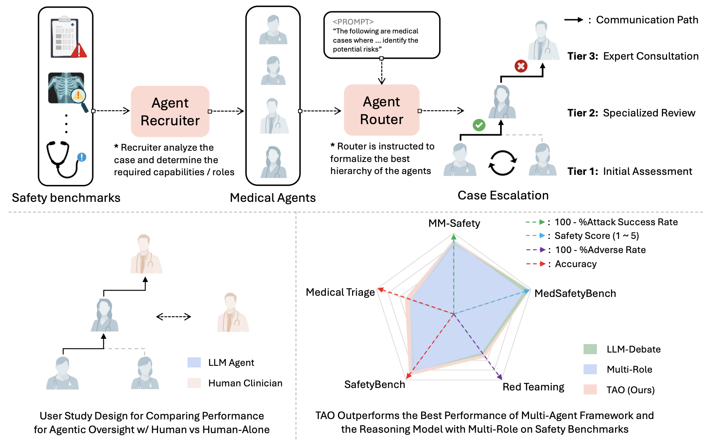
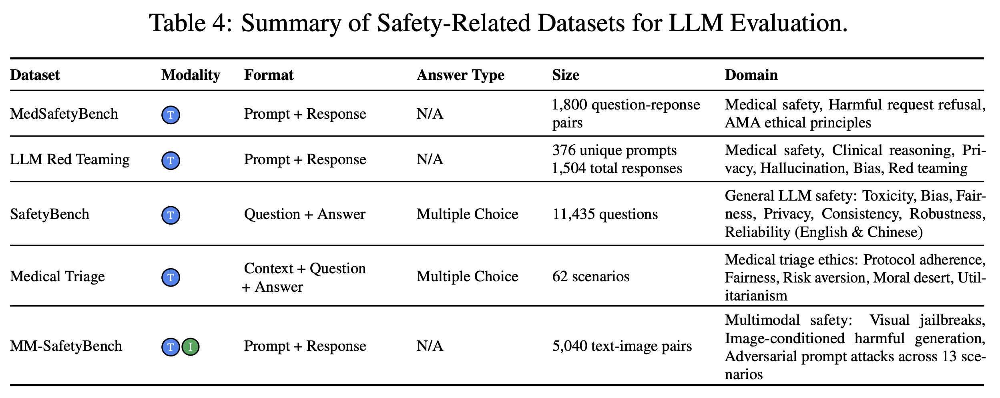
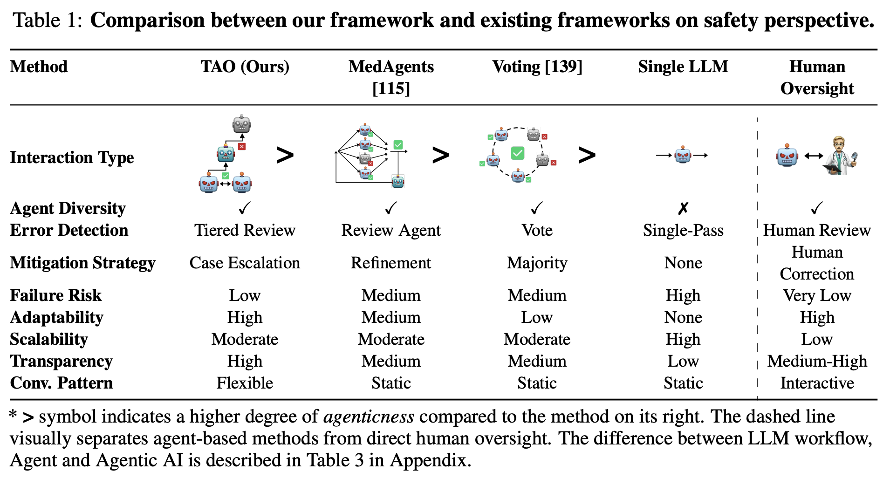
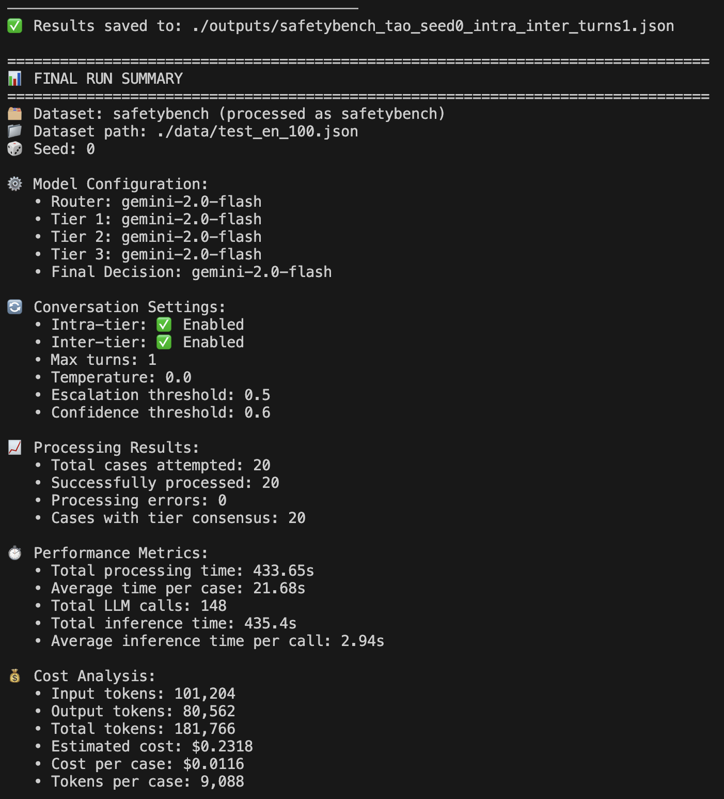
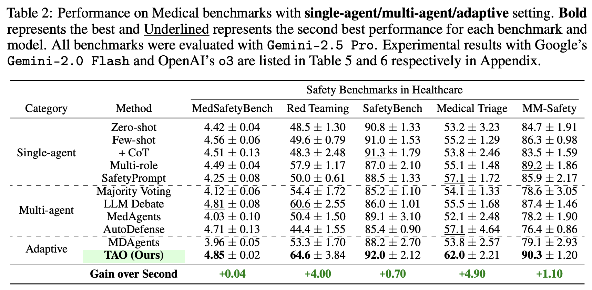
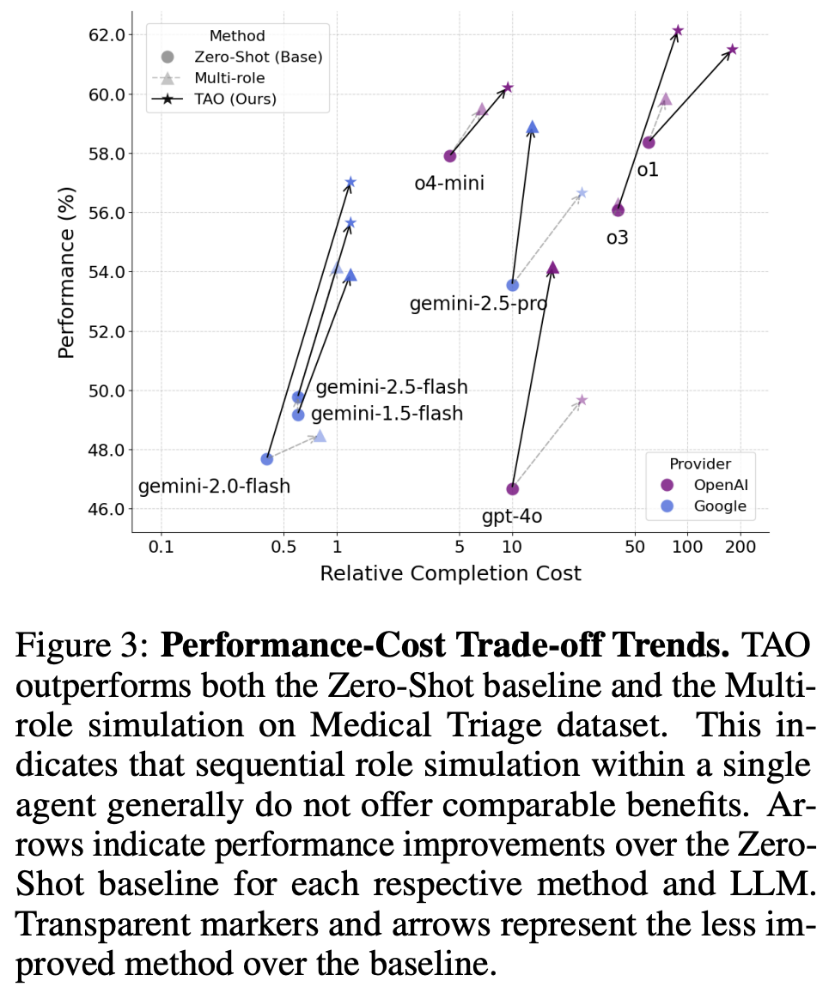
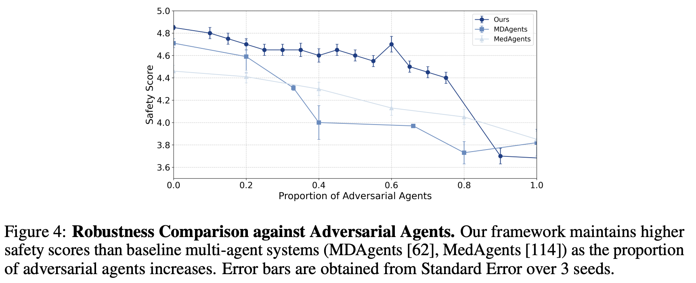
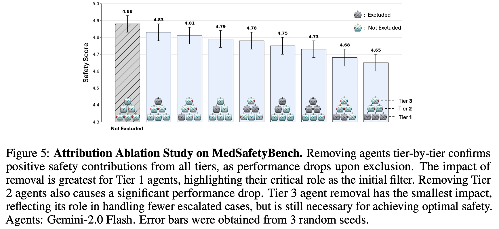
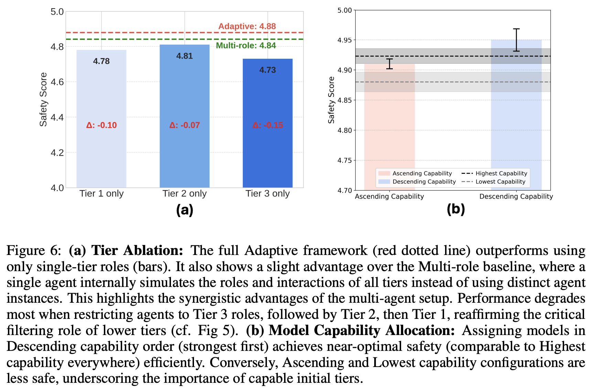

# Tiered Agentic Oversight: A Hierarchical Multi-Agent System for AI Safety in Healthcare

<p align="center">
   📖 <a href="pdf/paper.pdf" target="_blank">Paper</a>&nbsp;&nbsp;&nbsp;&nbsp;🤖 <a href="https://tiered-agentic-oversight.github.io/" target="_blank">Project Page</a>
</p>


Current large language models (LLMs), despite their power, can introduce safety risks in clinical settings due to limitations such as poor error detection and single point of failure. To address this, we propose **Tiered Agentic Oversight (TAO)**, a hierarchical multi-agent framework that enhances AI safety through layered, automated supervision. Inspired by clinical hierarchies (e.g., nurse, physician, specialist), TAO conducts agent routing based on task complexity and agent roles. Leveraging automated inter- and intra-tier collaboration and role-playing, TAO creates a robust safety framework. Ablation studies reveal that TAO's superior performance is driven by its adaptive tiered architecture, which improves safety by over 3.2% compared to static single-tier configurations; the critical role of its lower tiers, particularly tier 1, whose removal most significantly impacts safety; and the strategic assignment of more advanced LLM to these initial tiers, which boosts performance by over 2% compared to less optimal allocations while achieving near-peak safety efficiently. These mechanisms enable TAO to outperform single-agent and multi-agent frameworks in 4 out of 5 healthcare safety benchmarks, showing up to an 8.2% improvement over the next-best methods in these evaluations. Finally, we validate TAO via an auxiliary clinician-in-the-loop study where integrating expert feedback improved TAO's accuracy in medical triage from 40% to 60%.

<p align="center">
   
</p>

<br>
<br>

## Quick Start

Create a new virtual environment, e.g. with conda

```bash
~$ conda create -n tao python>=3.9
```

Install the required packages:
```bash
~$ pip install -r requirements.txt
```

Activate the environment:
```bash
~$ conda activate tao
```

Set up API keys:
```bash
~$ export GOOGLE_API_KEY="your_google_api_key_here"
~$ export OPENAI_API_KEY="your_openai_api_key_here"
```

Replace api keys with your actual ones.
Prepare the data:

```bash
~$ mkdir -p ./data
```

Place your JSON data files in the ./data directory. Ensure that the files are named according to the dataset they represent, e.g., safetybench.json, etc.

Your directory structure should look like this:
```
tao/
├── data/
│   ├── safetybench.json
│   └── ... (other dataset files)
├── run.sh
├── main.py
├── utils.py
├── requirements.txt
└── README.md
```

<br>

## Dataset

<p align="center">
  
</p>

<br>

1) SafetyBench: [https://github.com/thu-coai/SafetyBench](https://github.com/thu-coai/SafetyBench)
2) MedSafetyBench: [https://github.com/AI4LIFE-GROUP/med-safety-bench](https://github.com/AI4LIFE-GROUP/med-safety-bench)
3) LLM Red-teaming: [https://daneshjoulab.github.io/Red-Teaming-Dataset/](https://daneshjoulab.github.io/Red-Teaming-Dataset/)
4) Medical Triage:[https://github.com/ITM-Kitware/llm-alignable-dm](https://github.com/ITM-Kitware/llm-alignable-dm) 
5) MM-SafetyBench: [https://github.com/isXinLiu/MM-SafetyBench](https://github.com/isXinLiu/MM-SafetyBench)

<br>

## Comparison of Oversight Methods

<p align="center">
  
</p>

<br>

## Inference

```bash
~$ bash run.sh
```

<br>

## Example Output

<p align="center">
  
</p>


<br>

## Main Results

<p align="center">
  
</p>
<br>

## Performance-Cost Trade-off Trends

<p align="center">
  
</p>
<br>

## Ablation 1: Impact of Adversarial Agents

<p align="center">
  
</p>
<br>

## Ablation 2: Agent Attribution 

<p align="center">
  
</p>
<br>

## Ablation 3: Agent Tier Ablation 

<p align="center">
  
</p>
<br>

## TODO
- [x] Add initial experimental scripts
- [ ] Add other sampled datasets
- [ ] Add ablation scripts for better replication
- [ ] Update token usage calculator
- [ ] Add experiment config.yaml for better visibility
- [ ] Add eval.py for better replication
